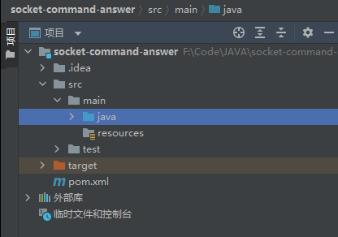
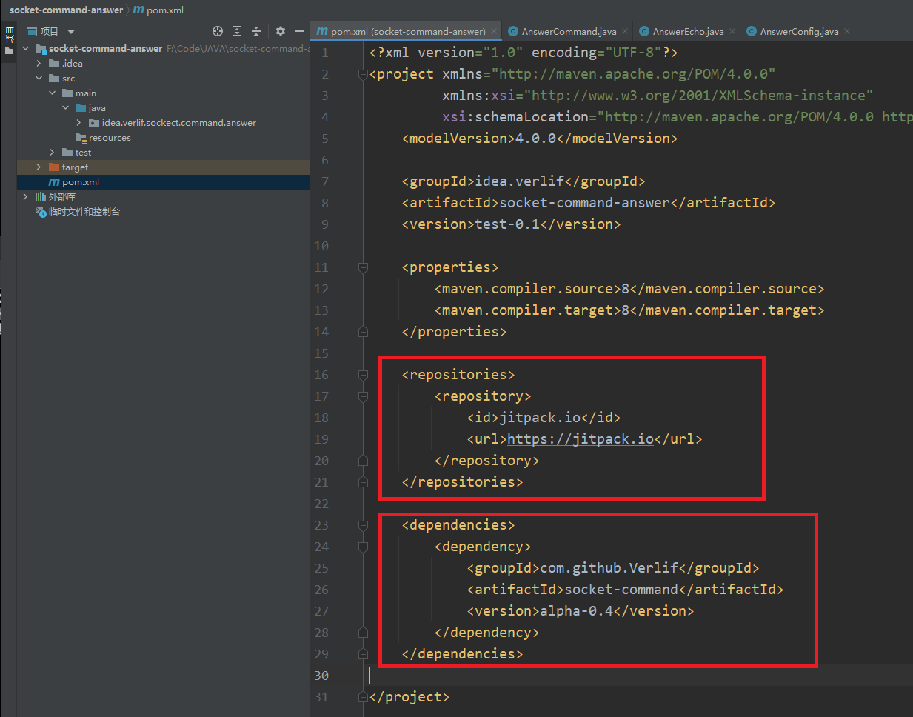
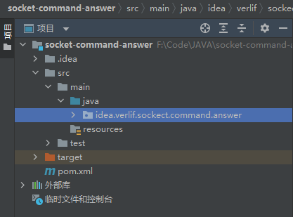
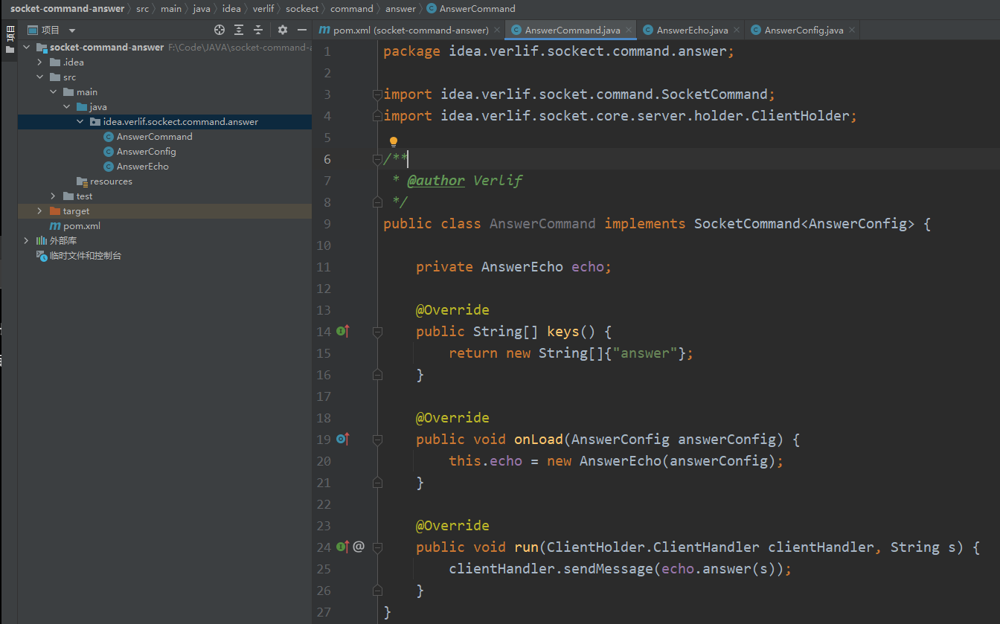
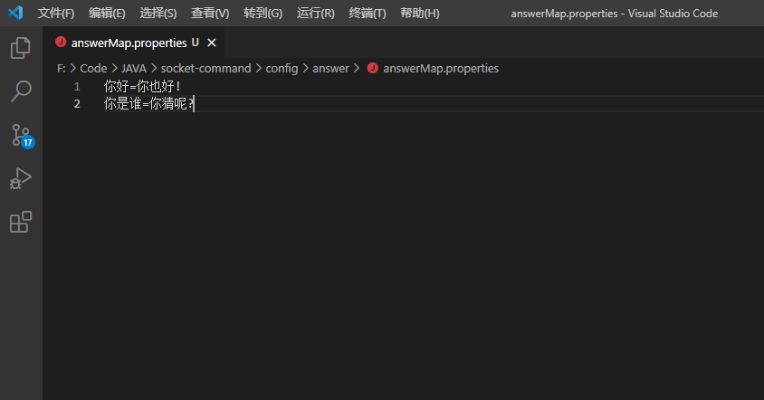
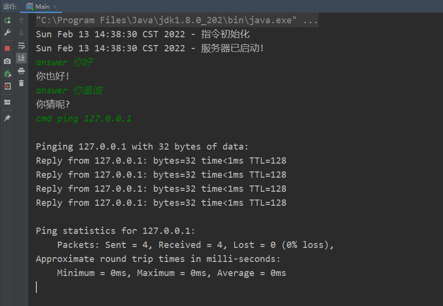

# 创建一个回复指令包

这里用一个简单的回复指令做演示。另外如果希望将指令包分享出去的话，请在仓库的`topic`中加上`socket-command-extend`。

注：若图片加载不成功，请在`instructions`目录下查看

## 1. 新建一个`Maven`项目



此过程不做详说，可以通过IDE来快速创建，也可以通过Maven命令创建

## 2. 引入指令依赖



这里需要引入`socket-command`的仓库`jitpack.io`  
然后引入`socket-command`，版本号请在`jitpack.io`或`Github`上选择

## 3. 创建自己的包



包名请随意

## 4. 新建指令配置

*若不需要配置，可跳过此步骤*

```java
// 配置需要实现ConfigAdapter接口
public class AnswerConfig implements ConfigAdapter {

    /**
     * 在此配置中只有一个参数，就是回答Map文件所在路径。
     * 在配置中的参数请给予一个默认值，便于配置文件的生成。
     */
    private String dataPath = "config/answer/answerMap.properties";

    /**
     * 配置文件名的前缀。
     * 不一定要与指令key相同，但不要与其他的指令配置文件名重复。
     */
    @Override
    public String key() {
        return "answer";
    }

    /**
     * Get方法
     */
    public String getDataPath() {
        return dataPath;
    }

    /**
     * Set方法
     */
    public void setDataPath(String dataPath) {
        this.dataPath = dataPath;
    }

    /**
     * 获取回答Map的Properties对象。
     */
    public Properties getProperties() {
        File file = new File(dataPath);
        if (!file.exists()) {
            File dir = file.getParentFile();
            if (!dir.exists()) {
                if (!dir.mkdirs()) {
                    return null;
                }
            }
            try {
                file.createNewFile();
            } catch (IOException ignored) {
            }
        }
        if (file.exists()) {
            Properties properties = new Properties();
            try {
                properties.load(new FileReader(file));
            } catch (IOException ignored) {
            }
            return properties;
        } else {
            return null;
        }
    }
}
```

## 5. 新建指令

`AnswerCommand`

```java
// 指令需要继承SocketCommand接口，接口泛型则是此接口需要的配置类。不需要可以不要泛型
public class AnswerCommand implements SocketCommand<AnswerConfig> {

    private AnswerEcho echo;

    /**
     * 指令名组。
     * 当指令名是其数组中的其中之一时，则会触发此指令。
     */
    @Override
    public String[] keys() {
        return new String[]{"answer"};
    }

    /**
     * 指令被加载时调用。
     * 当没有配置泛型或是指令包中没有配置类时，方法参数是NULL。
     */
    @Override
    public void onLoad(AnswerConfig answerConfig) {
        this.echo = new AnswerEcho(answerConfig);
    }

    /**
     * 指令运行方法。
     * 
     * @param clientHandler 指令请求客户端。
     * @param s 指令内容。
     */
    @Override
    public void run(ClientHolder.ClientHandler clientHandler, String s) {
        clientHandler.sendMessage(echo.answer(s));
    }

    /**
     * 指令被销毁时调用。
     * 若在指令中有持续运行的线程或是其他持有资源时，请在这里释放。
     */
    @Override
    public void onDestroy() {}
}
```

`AnswerEcho`

```java
public class AnswerEcho {

    private final Properties properties;

    public AnswerEcho(AnswerConfig config) {
        properties = config.getProperties();
    }

    /**
     * 获取问题的回答
     *
     * @param question 问题文本
     * @return 对应问题的回答
     */
    public String answer(String question) {
        return properties == null ? "Unknown!" : properties.getProperty(question);
    }
}
```

## 6. 当前的目录结构

结构无所谓，就按照正常的Maven编写结构就可以。  
一个指令包可以包括任意数量的指令，这里的演示就放一个指令。



## 7. 打包指令包

指令包的打包就按照Maven方式打包就可以了。  
例如：

> maven clean  
> maven package

然后就可以在`target`中找到`jar包`。

## 8. 加载指令并生成配置文件

以下为了测试就将服务端与客户端运行于同一个机器下 *（可在配置中修改连接的IP与端口）*

```java
public class Main {

    public static void main(String[] args) throws IOException {
        // 这里在初始化前加载两个指令包
        CommandServer server = new CommandServer(new CommandConfig()
                .path("F:\\Download\\socket-command-cmd-1.0.jar")
                .path("F:\\Code\\JAVA\\socket-command-answer\\target\\socket-command-answer-test-0.1.jar"));
        System.out.println(new Date() + " - 指令初始化");
        // 指令初始化
        server.init();
        // 以新线程来运行服务端
        new Thread(() -> {
            try {
                server.start();
                System.out.println(new Date() + " - 服务器已启动!");
            } catch (IOException e) {
                e.printStackTrace();
            }
        }).start();
        
        // 新建客户端，并设定服务端消息处理
        Client client = new Client(new ClientConfig()
                .handler(new ReceiveHandler() {
                    @Override
                    public void receive(Client client, String s) {
                        System.out.println(s);
                    }
                }));
        // 连接服务器
        client.connect();
        // 将控制台输入作为指令发送给服务器
        Scanner in = new Scanner(System.in);
        while (client.isConnected()) {
            client.sendMessage(in.nextLine());
        }
    }
}
```

在运行了`main`方法后，即可在此项目目录下发现`config`目录。
并且由于`answer`指令的设定，会在`config`下生成`answer`目录，其下有一个`answerMap.properties`文件。  
编辑`answerMap.properties`文件，添加两个测试用的对话:



## 9. 重新加载配置

重启Server，然后就可以输入指令了。

