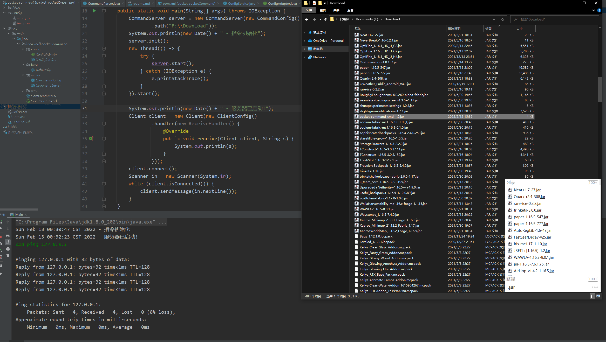

# CommandSocket

Socket指令交互组件  
基于 [socket-core](https://github.com/socket-core) 与 [loader-jar](https://github.com/loader-jar) 的组合组件。
通过类似于加载模组的方式，通过加载jar文件的方式来加载指令，然后通过socket的方式来执行指令。

* 一个服务端可以连接任意数量客户端
* 开放式指令包，5分钟完成指令包创建
* 方便拓展与修改，定制自己的指令流程

## 使用

Socket指令在使用时，可以加载`jar文件`，也可以加载`SocketCommand`对象。

```java
    // 当我们在 F:\command 目录下有指令包时，可以通过CommandConfig的方式初始化
    CommandServer server = new CommandServer(
            new CommandConfig().path(
                    "F:\\command"));
    // 可以动态加载或卸载指令包
    server.addCommand(new SocketCommand());
    // 将 F:\command-extra 文件夹加入指令集路径，并加载其中的指令包
    server.loadCommand("F:\\command-extra");
    // 从指令集中移除 key 为 "plus" 的指令
    server.removeCommand("plus");
    // 重新加载指令集路径中的所有指令包
    server.reload();
```

指令包指的是包含有`SocketCommand`实现类的`jar包`。  
指令包的制作：
1. 新建maven项目
2. 添加本组件作为依赖
3. 实现`SocketCommand`接口
4. 打包成jar包

详细方式请访问 [如何创建指令包](instructions/如何创建指令包.md)

## 添加

1. 添加Jitpack仓库源

> maven
> ```xml
> <repositories>
>    <repository>
>        <id>jitpack.io</id>
>        <url>https://jitpack.io</url>
>    </repository>
> </repositories>
> ```

> Gradle
> ```text
> allprojects {
>   repositories {
>       maven { url 'https://jitpack.io' }
>   }
> }
> ```

2. 添加依赖

> maven
> ```xml
>    <dependencies>
>        <dependency>
>            <groupId>com.github.Verlif</groupId>
>            <artifactId>socket-command</artifactId>
>            <version>alpha-0.5</version>
>        </dependency>
>    </dependencies>
> ```

> Gradle
> ```text
> dependencies {
>   implementation 'com.github.Verlif:socket-command:alpha-0.5'
> }
> ```

## 示例

这里有一个这样的指令在指令包`F:\command\testCommand.jar`中:

```java
public class PlusCommand implements SocketCommand<PlusConfig> {
    
    private PlusConfig config;
    
    @Override
    public String[] keys() {
        return new String[]{"plus"};
    }

    @Override
    public void onLoad(PlusConfig config) {
        this.config = config;
    }

    /**
     * 其作用就是使用plus指令来获得后两个数字的和
     **/
    @Override
    public void run(ClientHolder.ClientHandler clientHandler, String s) {
        String[] ss = s.split(" ");
        if (ss.length > 1) {
            clientHandler.sendMessage(config.prefix + String.valueOf(Integer.parseInt(ss[0]) + Integer.parseInt(ss[1])));
        } else {
            clientHandler.sendMessage(config.prefix + s);
        }
    }
}
```

其中`PlusConfig`是实现了`ConfigAdapter`接口的配置，服务端会自动加载并生成配置文件。

```java
public class PlusConfig implements ConfigAdapter {

    private String prefix = "result = ";

    /**
     * 配置文件唯一Key
     *
     * @return 用于生成配置文件名
     */
    @Override
    public String key() {
        return "plus";
    }

    public String getPrefix() {
        return prefix;
    }

    public void setPrefix(String prefix) {
        this.prefix = prefix;
    }
}
```

在第一次加载`PlusCommand`指令时，会根据其配置类自动生成配置文件`config\plus.json`：

```json
{"prefix": "result = "}
```

可以通过更改配置文件来修改指令的配置（修改后需要重启服务端）

在指令服务器代码中使用以下方式添加上面的指令包：

```java
// 新建指令Socket对象，并初始化指令包路径。
CommandServer server = new CommandServer(
        new CommandConfig().path(
            // 这里的路径可以是包所在的文件夹，也可以直接指定包路径
            // "F:\\command\\testCommand.jar"));
            "F:\\command"));
// 服务端初始化
server.init();
// 启动服务端
server.start();
```

在客户端输入指令：

```text
plus 1 2
```

在客户端与服务端通信后，客户端会收到以下信息：

```text
result = 3
```

## 指令包加载图片演示

  

上方的图片中，加载了`F:\Download`目录，则指令就会从其下所有的jar包中寻找可用的指令。
其中除了`socket-command-cmd-1.0.jar`包含有指令之外，其他的都是`minecraft`的模组文件，共计105个文件。
在控制台可以看出，服务端加载指令约2分钟后（文件数量越多，搜寻的时间越长）。  
